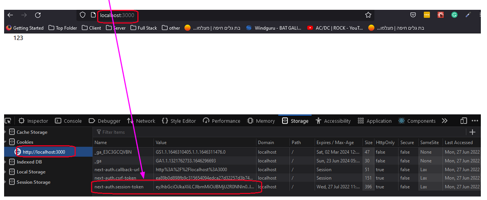
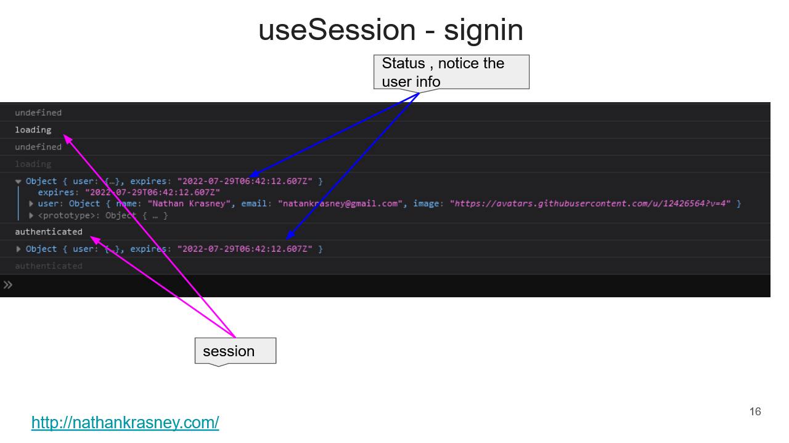

<h2>Motivation</h2>
Experiment with authentication in next.js via NextAuth and Github as OAuth provider

<h2>Points of interest</h2>
<ul>
<li>[...nextauth].ts under api/auth is used to catch all routes, check <a href='https://nextjs.org/docs/routing/dynamic-routes'>here</a>. in this case signout and signin</li>
</ul>

<h2>enviromental variable</h2>
are saved in .env.local

<h2>Authentication provider - [...nextauth].ts</h2>

```ts

import NextAuth from "next-auth";
import GitHubProvider from "next-auth/providers/github";

export default NextAuth({
  providers: [
    GitHubProvider({
      clientId: process.env.GITHUB_ID,
      clientSecret: process.env.GITHUB_SECRET
    }),
  ],
});

```

<h2>signin \ signout</h2>
This is super easy using signIn, signOut, useSession

```ts
import styles from "../styles/Home.module.css";
import { signIn, signOut, useSession } from "next-auth/react";

const Home: NextPage = () => {
  const { data: session, status } = useSession();

  console.log(session);
  console.log(status);

  return (
    <div className={styles.container}>
      <button onClick={() => signIn("github")}>SignIn</button>
      <button onClick={() => signOut()}>SignOut</button>
      <p>{status === "authenticated" ? 'signin' : 'signout'}</p>
    </div>
  );
};

export default Home;
```

<h2>cookie</h2>

the auth data appears in a cookie. this cookie is removed after sign out




info from useSession




<h2>.env.local on production</h2>
This file is in .gitignore so you need to put the enviroment variable on vercel


<h2>open issues</h2>
<ul>
<li>for some reason i get a warning . not clear why but it is working
<p>[next-auth][warn][NO_SECRET] 
https://next-auth.js.org/warnings#no_secret</p>
</li>
</ul>